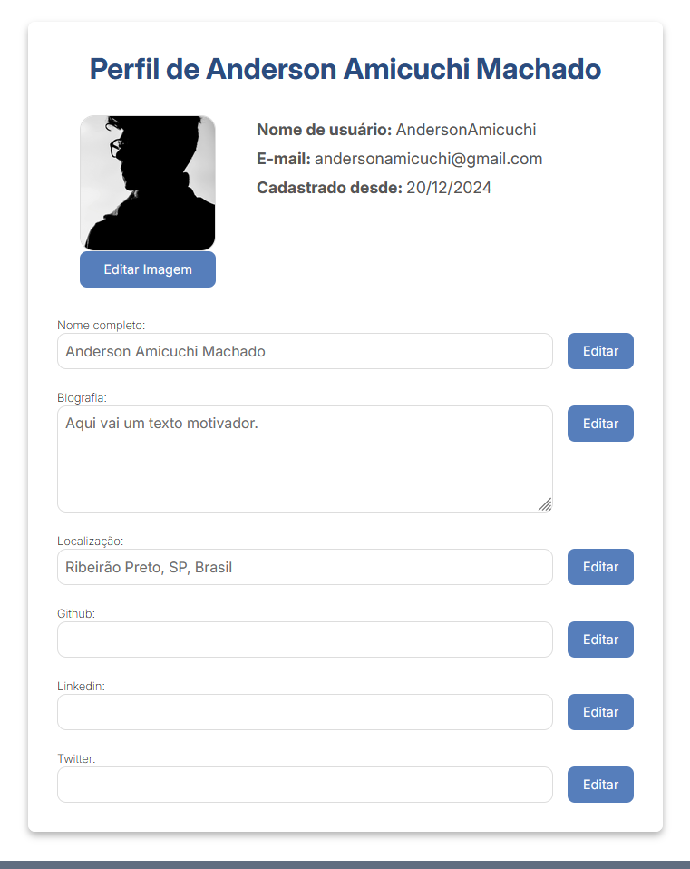
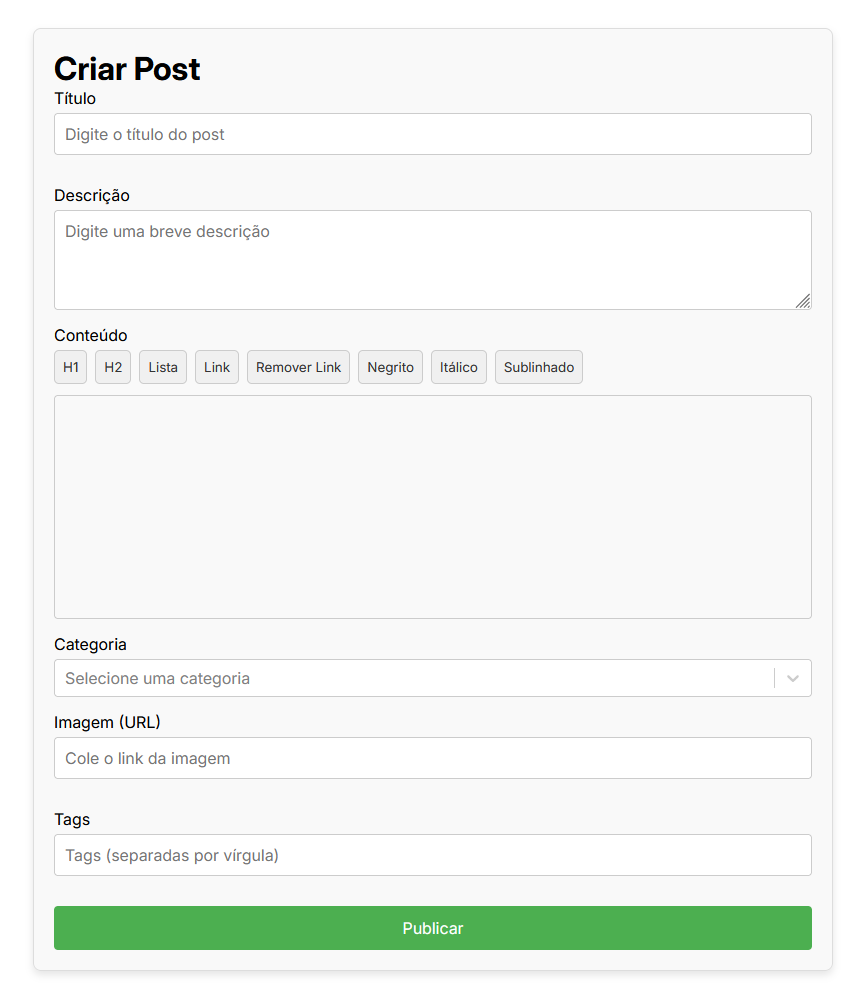
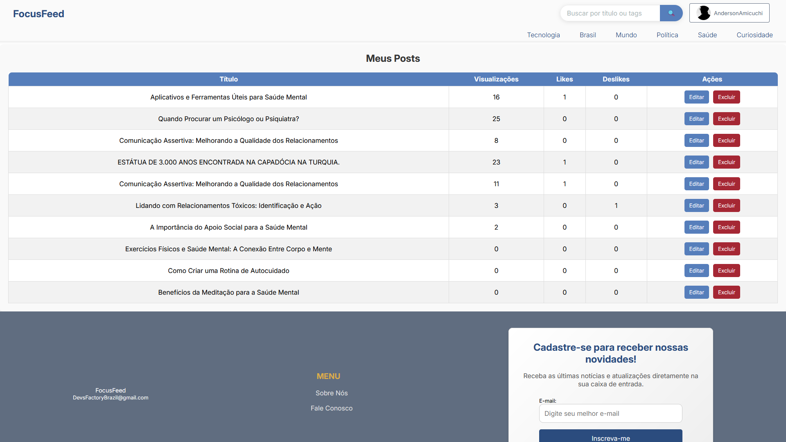
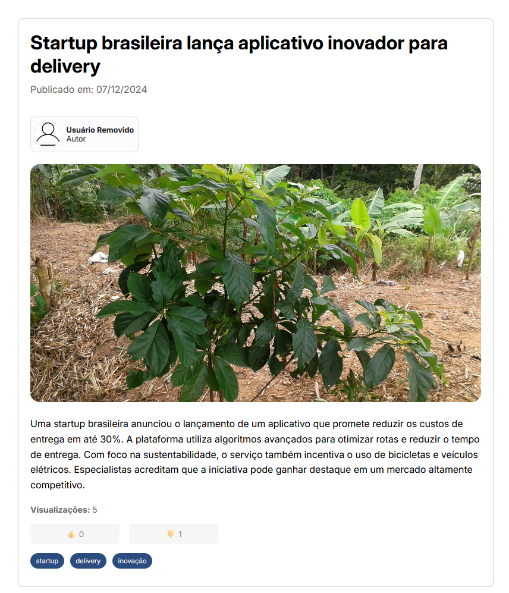

# Blog Focus Feed

FocusFeed é uma plataforma moderna de blog construída com a stack MERN, oferecendo uma experiência intuitiva para criação e compartilhamento de conteúdo. Com um editor rico em recursos e um sistema robusto de gerenciamento de conteúdo, o FocusFeed proporciona todas as ferramentas necessárias para autores expressarem suas ideias.

[](https://choosealicense.com/licenses/mit/)
[](https://github.com/Amicuchi/)
[](https://reactjs.org/)
[](https://nodejs.org/)

## 🚀 Funcionalidades

### Gerenciamento de Conteúdo

- Editor de texto rico com suporte para formatação avançada (H1, H2, listas, links, negrito, itálico, sublinhado)
- Sistema de categorização de posts
- Suporte para tags
- Upload de imagens via URL
- Sistema de preview antes da publicação

### Interação e Engajamento

- Sistema de likes/dislikes em posts
- Contador de visualizações
- Perfis personalizáveis de autores
- Newsletter para acompanhamento de atualizações

### Gestão de Usuários

- Sistema completo de autenticação
- Perfis personalizáveis
- Dashboard para gestão de posts
- Métricas de engajamento por post

## 🛠️ Tecnologias

### Frontend

```json
{
  "react": "18.3.1",
  "react-router-dom": "7.1.1",
  "react-hook-form": "7.53.2",
  "@tiptap/react": "2.10.3",
  "axios": "1.7.8",
  "vite": "6.0.1"
}
```

### Backend

```json
{
  "express": "4.21.1",
  "mongoose": "8.8.3",
  "jsonwebtoken": "9.0.2",
  "nodemailer": "6.9.16",
  "bcrypt": "5.1.1"
}
```

## 📦 Instalação

1. Clone o repositório

```bash

git clone https://github.com/Amicuchi/BlogFocusFeed.git
cd BlogFocusFeed

```

2. Instale as dependências

```bash
# Raiz do projeto
npm install

# Backend
cd backend
npm install

# Frontend
cd ../frontend
npm install

```

3. Configure as variáveis de ambiente

Backend (.env):

```env

# Configurações do Servidor
PORT=5000
NODE_ENV=development

# Configurações do MongoDB
MONGODB_URI=sua_uri_mongodb

# Configurações de Segurança
CORS_ORIGIN=http://localhost:5173
RATE_LIMIT_MAX=100

# Configurações de Email
EMAIL_USER=seu_email@gmail.com
EMAIL_PASS=sua_senha_app 
FRONTEND_URL=http://localhost:5173

# Segurança
JWT_SECRET=seu_jwt_secret
JWT_EXPIRES_IN=1d

```

Frontend (.env):

```env

VITE_API_BASE_URL=http://localhost:5000

```

4. Inicie a aplicação

```bash

# Na pasta raiz da aplicação
npm run dev

```

## 🔍 Uso da API

### Autenticação

```javascript
// Registro de usuário

// Controller
export const registerUser = async (req, res, next) => {
  try {
    const result = await UserService.registerUser(req.body);
    res.status(201).json({
      message: 'Usuário registrado com sucesso',
      data: result,
    });
  } catch (error) {
    next(error);
  }
};

// Service
async registerUser(userData) {
    const { username, email, password, fullName } = userData;

    // Verifica se o usuário já está cadastrado
    const existingUser = await User.findOne({ $or: [{ email }, { username }] });
    if (existingUser) {
        throw new Error('Usuário já cadastrado');
    }

    // Rehash a senha recebida do frontend com bcrypt
    const hashedPassword = await bcrypt.hash(password, 10);

    const newUser = new User({
        username,
        email,
        fullName,
        password: hashedPassword
    });

    await newUser.save();

    return {
        message: 'Usuário cadastrado com sucesso',
        userId: newUser._id
    };
}


// Login
// Controller
export const loginUser = async (req, res, next) => {
  try {
    const { email, password } = req.body;
    const result = await UserService.loginUser(email, password);
    res.status(200).json({
      message: 'Login realizado com sucesso',
      data: result,
    });
  } catch (error) {
    next(error);
  }
};

// Service
async loginUser(email, password) {
    const user = await User.findOne({ email });
    if (!user) {
        throw new Error('Credenciais inválidas');
    }

    // Compara a senha hasheada recebida com a armazenada
    const isMatch = await bcrypt.compare(password, user.password);
    if (!isMatch) {
        throw new Error('Credenciais inválidas');
    }

    // Gera o token JWT
    const token = jwt.sign(
        { id: user._id, username: user.username },
        process.env.JWT_SECRET,
        { expiresIn: '1d' }
    );

    return {
        message: 'Login realizado com sucesso',
        token,
        user: {
            id: user._id,
            username: user.username,
            email: user.email
        }
    };
}

```

### Gestão de Posts

```javascript
// Controller
export const createPost = async (req, res, next) => {
  try {
    const savedPost = await PostService.createPost(req.body, req.user.id);
    res.status(201).json({
      message: "Post criado com sucesso",
      data: savedPost,
    });
  } catch (error) {
    next(error);
  }
};
```

```javascript
// Service
async createPost(postData, userId) {
    const description = postData.content.substring(0, 200);

    const newPost = new Post({
        ...postData,
        description,
        author: userId,
    });

    const savedPost = await newPost.save();

    await User.findByIdAndUpdate(
        userId,
        { $push: { posts: savedPost._id } }
    );

    return savedPost;
}
```

## 🔐 Endpoints da API

```javascript
// Usuários
POST   /api/users/register       // Registro de usuário
POST   /api/users/login          // Login
GET    /api/users/user           // Perfil do usuário
PUT    /api/users/user           // Atualização de perfil
DELETE /api/users/user           // Exclusão de conta

// Posts
GET    /api/posts                // Lista todos os posts
GET    /api/posts/:id            // Detalhes do post
POST   /api/posts                // Cria novo post
PUT    /api/posts/:id            // Atualiza post
DELETE /api/posts/posts/:id      // Remove post
POST   /api/posts/:id/like       // Like em post
POST   /api/posts/:id/dislike    // Dislike em post
```

## 📱 Screenshots

### Home


### Perfil de Usuário



### Editor de Posts



### Posts do Usuário



### Posts Aberto



## 🤝 Contribuição

1. Faça um Fork do projeto
2. Crie uma Branch para sua Feature (`git checkout -b feature/AmazingFeature`)
3. Commit suas mudanças (`git commit -m 'Add some AmazingFeature'`)
4. Push para a Branch (`git push origin feature/AmazingFeature`)
5. Abra um Pull Request

## Atualizações e Correções (com as quais você pode contribuir)

Aqui estão algumas sugestões de melhorias nas quais você pode colaborar para melhorar o projeto:

### Funcionalidades

- [ ] **Sistema de Preview Antes da Publicação:** Implementar um sistema de visualização para o usuário antes de publicar um post, permitindo ajustes finais.

- [ ] **Criação de Posts Patrocinados:** Adicionar a funcionalidade para criar posts patrocinados, onde o usuário poderá selecionar essa opção ao criar um post. Após a publicação, um aviso pequeno será exibido (ex.: "Post Patrocinado", similar aos marketplaces como Mercado Livre e Facebook).

- [ ] **Normalização de Tags:** Ao adicionar uma nova tag, o sistema deve normalizá-la, removendo acentos, espaços e aplicando o formato PascalCase, garantindo consistência no banco de dados.

### Segurança

- [ ] **Proteção Contra Injeção de SQL:** Embora a aplicação utilize **MongoDB**, é fundamental proteger contra injeções de NoSQL, validando e sanitizando todas as entradas de usuário.

- [ ] **Escalonamento de Ações Sensíveis:** Algumas ações mais delicadas, como a exclusão de um usuário, podem exigir uma confirmação ou justificativa que seja registrada no sistema, aumentando a segurança e controle.

### Testes

- [ ] **Testes Automatizados:** Desenvolver testes unitários e de integração para garantir que os **controllers** e **services** funcionem conforme esperado. Isso facilita a manutenção e ajuda a prevenir regressões no código.

### Documentação

- [ ] **Documentação de Código:** Utilizar comentários e documentação adequada para facilitar a compreensão do código por outros desenvolvedores ou por você mesmo no futuro. Utilizar ferramentas como **[Swagger](https://swagger.io/)** para documentar as rotas pode facilitar a manutenção e a colaboração futura.

### Logging

- [ ] **Logging (Logs e Auditorias):** Implementar um sistema de logging para registrar atividades importantes e erros. Ferramentas como **[Winston](https://github.com/winstonjs/winston)** ou **[Morgan](https://github.com/expressjs/morgan)** podem ser úteis. Ações críticas (ex.: mudança de cargo, exclusão de posts ou usuários) devem ser registradas para garantir rastreabilidade e transparência.

---

### Links e Referências

- **[Swagger](https://swagger.io/)** – Para documentação de APIs.
- **[Winston](https://github.com/winstonjs/winston)** – Para logging de eventos.
- **[Morgan](https://github.com/expressjs/morgan)** – Para logging HTTP.
- **[MongoDB](https://www.mongodb.com/)** – Banco de dados NoSQL utilizado na aplicação.

## 📝 Licença

Este projeto está sob a licença MIT. Veja o arquivo [LICENSE](LICENSE) para mais detalhes.

## 📫 Contato

Anderson Amicuchi Machado - [@Amicuchi](https://linkedin.com/in/Amicuchi)

Link do Projeto: [https://github.com/Amicuchi/BlogFocusFeed](https://github.com/Amicuchi/BlogFocusFeed)